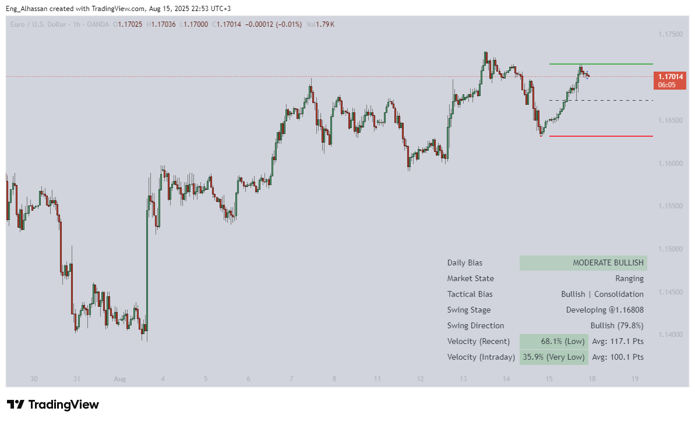
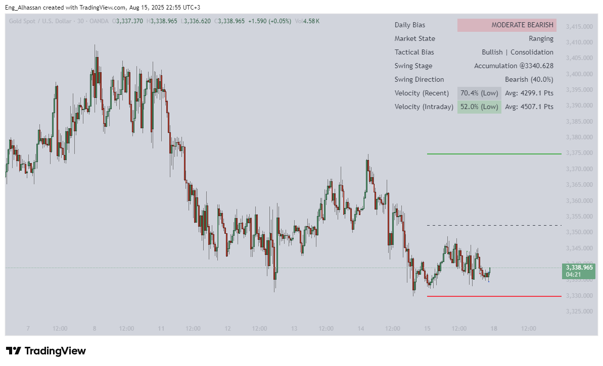
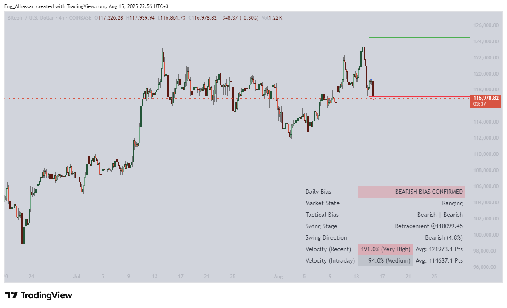
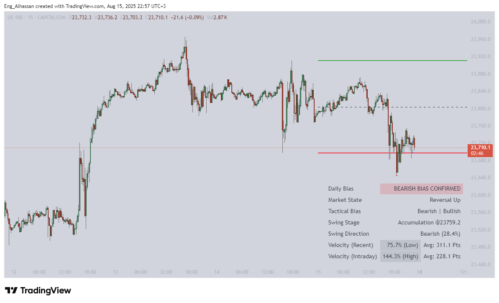
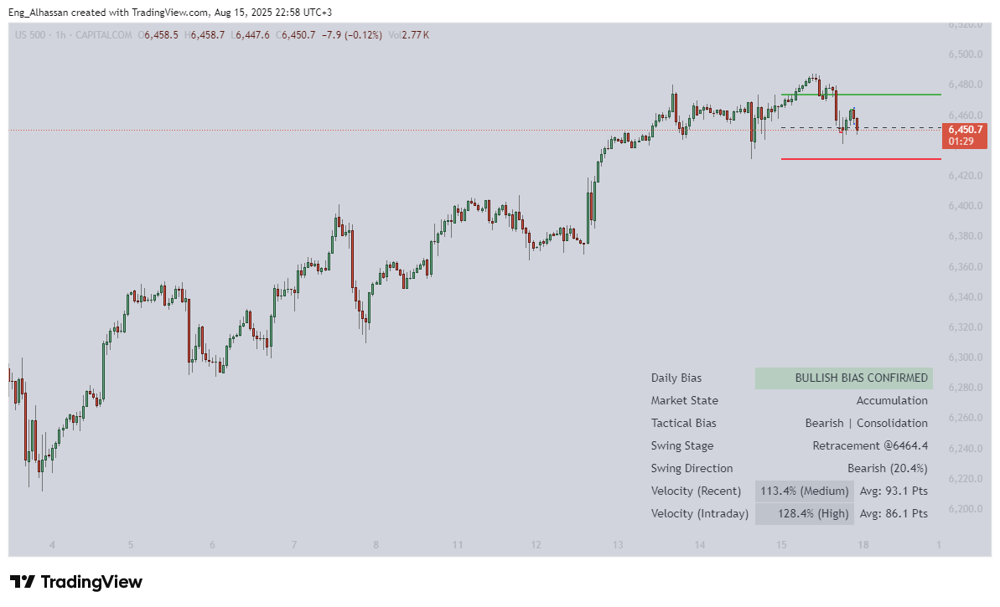

# Health Market Indicator

An advanced, multi-layered market analysis tool for TradingView, designed to diagnose market health by moving beyond simple signals into a comprehensive, contextual framework.

---

## Table of Contents

1.  [The Philosophy: Beyond Signals, Towards Diagnosis](#1-the-philosophy-beyond-signals-towards-diagnosis)
2.  [Key Features](#2-key-features)
3.  [Showcase: The Indicator in Action](#3-showcase-the-indicator-in-action)
4.  [The Dashboard: Deconstructing the 7 Layers of Analysis](#4-the-dashboard-deconstructing-the-7-layers-of-analysis)
5.  [Professional Application: The Power of Confluence](#5-professional-application-the-power-of-confluence)
6.  [Target Audience & Use Case](#6-target-audience--use-case)
7.  [Installation](#7-installation)
8.  [Connect with the Author](#8-connect-with-the-author)
9.  [Contributing](#9-contributing)
10. [Legal Disclaimer](#10-legal-disclaimer)
11. [License](#11-license)

## 1. The Philosophy: Beyond Signals, Towards Diagnosis

In a world saturated with indicators that measure a single variable—be it momentum, trend, or volume—the Health Market Indicator introduces a paradigm shift. Its core philosophy is not to generate a signal, but to **diagnose the market's overall "health"** by integrating 7 distinct layers of analysis into one cohesive dashboard.

Think of it as a physician's diagnostic panel. A decision is never based on temperature alone; it requires context from heart rate, blood pressure, and lab results. This indicator provides that panoramic view, from the high-level strategic bias down to the pulse of the current candle.

> It is designed to answer critical questions:
>
> - Is the market accumulating energy for a major move?
> - Is it expanding with genuine conviction?
> - Or is it showing signs of exhaustion, vulnerable to a reversal?

This holistic approach liberates the trader from the noise of conflicting signals, offering a coherent narrative of what the market is doing—and what it's likely to do next.

## 2. Key Features

- **7-Layer Analysis:** Integrates strategic, tactical, and velocity metrics into one dashboard.
- **Context-Aware:** Doesn't just provide signals; it tells you the _story_ behind the price action (e.g., Accumulation, Expansion, Reversal).
- **Confluence & Divergence:** Empowers traders to identify high-probability setups through layer alignment and spot warnings through divergence.
- **Universal Logic:** Adapts seamlessly across all markets (Forex, Crypto, Indices, etc.) and timeframes.
- **Professional Grade:** Built for discretionary traders who require deep, real-time market insights.

## 3. Showcase: The Indicator in Action

The indicator's universal logic allows it to adapt seamlessly across all markets. The `/pic` directory contains samples for major asset classes, demonstrating its versatility.

It is important to note that these screenshots were captured on **Friday, August 15, 2025, around 20:00 UTC**—a period of typically low market liquidity. This demonstrates the indicator's clarity and effectiveness even in challenging market conditions.

### Forex: EUR/USD

### Commodities: XAU/USD (Gold)

### Crypto: BTC/USD

### Indices: US100 (Nasdaq)

### Indices: US500 (S&P 500)

### Oil: WTI Crude

## 4. The Dashboard: Deconstructing the 7 Layers of Analysis

The dashboard is the heart of the indicator. Each row is a distinct analytical layer, designed to build a complete narrative when read together.

| #   | Metric                  | Technical Breakdown                                                                                                                                                                                                    | Practical Significance                                                                                                                                                                        |
| --- | ----------------------- | ---------------------------------------------------------------------------------------------------------------------------------------------------------------------------------------------------------------------- | --------------------------------------------------------------------------------------------------------------------------------------------------------------------------------------------- | ----------------------------------------------------------------------------------------------------------- | --------------------------------------------------- |
| 1   | **Daily Bias**          | **Strategic Compass:** Compares price to the previous day's high (PDH), low (PDL), and equilibrium. Progresses from `NO BIAS` to `MODERATE` (post-midday) and `CONFIRMED` upon a breach of PDH/PDL.                    | **What's the strategic game plan for today?** It aligns you with the dominant daily flow, preventing trades that fight the market's primary intention.                                        |
| 2   | **Market State**        | **Contextual Narrative:** Identifies the "story" of the price action, such as `Accumulation` (coiling), `Expansion` (breakout), `Reversal` (failed breakout), `Retracement` (pullback), or `Ranging` (oscillation).    | **Why is the market moving?** It qualifies price action, distinguishing a genuine `Expansion` from a fakeout that becomes a `Reversal`, providing critical context.                           |
| 3   | **Tactical Bias**       | \*\*Live Pulse `[Daily Health]`                                                                                                                                                                                        | Momentum]`:** `Daily Health`is Close vs. Daily Open.`Momentum` compares the prior candle's close (`Close[1]`) to the high/low of the candle before it (`High/Low[2]`).                        | **What's happening right now?** Offers an instant, short-term snapshot for precise entry timing. A `Bullish | Bullish` reading signals strong immediate pressure. |
| 4   | **Swing Stage**         | **Intraday Story:** Analyzes price action _within the current day's range_. Tracks if the intraday swing is `Developing`, `Expanding` to new daily extremes, or `Accumulating` energy around the intraday equilibrium. | **What is the current session's internal structure?** Helps differentiate a major trend continuation from a minor pullback within the established daily range.                                |
| 5   | **Swing Direction**     | **Exhaustion & Reversal Meter:** Displays the current micro-swing's direction and its completion progress as a percentage (0% = start, 100% = end).                                                                    | **Is this move running out of steam?** A high progress reading (>85%) on a counter-trend move is a powerful exhaustion signal, often preceding a reversal or resumption of the primary trend. |
| 6   | **Velocity (Recent)**   | **Historical Power Meter:** Measures the current candle's range against the SMA of the last 'n' candles (default 50). It is accompanied by the Average Range in Points for the same period.                            | **How strong is this move compared to recent history?** A `Very High` velocity confirms breakout conviction. `Extreme` velocity can signal a climatic, exhaustive top or bottom.              |
| 7   | **Velocity (Intraday)** | **Session Power Meter:** Measures the current candle's range against the average of _today's candles only_. Also accompanied by the Average Range in Points for just the current session.                              | **Is volatility picking up or fading now?** Crucial for adapting to changing session dynamics, like the surge in volume during the London/NY overlap.                                         |

## 5. Professional Application: The Power of Confluence

The mastery of this indicator lies in observing the **confluence** (alignment) or **divergence** (contradiction) between its layers.

### High-Probability Setup (Confluence)

This occurs when multiple layers tell the same powerful story.

> **Example Scenario:**
>
> - `Daily Bias`: **BULLISH CONFIRMED**
> - `Market State`: **Expansion**
> - `Tactical Bias`: **Bullish | Bullish**
> - `Velocity (Recent)`: **180% (Very High)**
>
> **Translation:** The strategic direction is up, the market is actively breaking out, immediate momentum is bullish, and it's all happening with immense force. This is a high-conviction long signal.

### Warning Signal / Potential Reversal (Divergence)

This occurs when key layers contradict each other, signaling danger or a unique opportunity.

> **Example Scenario:**
>
> - `Daily Bias`: **BULLISH CONFIRMED**
> - `Swing Direction`: **Bearish (92%)**
> - `Velocity (Recent)`: **210% (Extreme)**
>
> **Translation:** While the strategic bias is bullish, a sharp counter-trend move has reached extreme exhaustion (92%) with climactic force. This is not a healthy pullback; it's a potential blow-off top, signaling a reversal is imminent. This is a clear warning to be cautious with longs or even look for a tactical short.

## 6. Target Audience & Use Case

This is not a beginner's tool for simple buy/sell signals. It is a professional-grade instrument designed for:

- **Discretionary Day Traders & Scalpers:** Who need a deep, real-time understanding of price action quality to make rapid, high-probability decisions.
- **Systematic Swing Traders:** Who can use the higher-level metrics (`Daily Bias`, `Market State`) as a powerful filter to qualify entries and exits for their strategies.

## 7. Installation

1.  Open [TradingView](https://www.tradingview.com/) and navigate to the **Pine Editor** tab.
2.  Clear any existing code.
3.  Copy the entire code from the `.pine` script file in this repository.
4.  Paste the code into your Pine Editor.
5.  Click **"Save"** and then **"Add to Chart"**.

## 8. Connect with the Author

Connect with **Eng. Alhassan Ali Mubarak Bahbah** for feedback, questions, or collaboration.

- [**GitHub**](https://github.com/EngAlhassan404)
- [**Twitter/X**](https://twitter.com/Mazyngo2)
- [**Instagram**](https://www.instagram.com/k_.x_o/)

## 9. Contributing

Contributions are welcome! If you have ideas for improvements or bug fixes, please open an issue or submit a pull request.

## 10. Legal Disclaimer

**Please read carefully before using this tool.**

This indicator is provided as a **Decision-Support Tool** only. Under no circumstances should any part of this indicator or its content be construed as **financial advice, an investment recommendation, or a solicitation to buy or sell any financial asset.**

Your use of this indicator is a personal choice and is done at **your own and absolute risk**. The author and any contributors to this project expressly disclaim any and all liability for any kind of loss or damage, whether financial or otherwise, direct or indirect, that may arise as a result of:

1.  **Reliance on the data or signals generated by the indicator.**
2.  **Misuse or misinterpretation of the indicator's output.**
3.  **Any trading or investment decision made based on this tool.**

Trading in financial markets involves a **substantial degree of risk** and may not be suitable for all investors, as it can lead to the loss of part or all of your invested capital. **Never trade with money you cannot afford to lose.**

It is strongly recommended that you seek advice from a **qualified and independent financial advisor** before making any investment decisions. By using this indicator, you acknowledge that you have read, understood, and agree to be bound by the terms of this disclaimer in full.

## 11. License

This project is licensed under the **MIT License**. See the [LICENSE](LICENSE) file for details.
